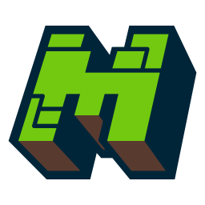

<h1 align="center">MC Launcher</h1>

<em><strong>(MC Launcher - Um Poderoso e Vers&aacute;til Launcher de Minecraft baseado em Eletron!)</strong></em>

  
  
  

  
  

Bem-vindo ao MC Launcher, o melhor e mais poderoso launcher para Minecraft baseado na tecnologia Eletron. 
Com uma interface amigável e uma série de recursos incríveis, você pode personalizar e gerenciar sua experiência no mundo do Minecraft como nunca antes.

## Recursos

- **Interface Intuitiva:** O MC Launcher possui uma interface amigável, tornando a navegação e a utilização do launcher uma experiência agradável para todos os usuários.
- **Gestão de Perfis:** Crie e gerencie facilmente vários perfis de Minecraft, permitindo alternar entre diferentes configurações, mods e versões do jogo com um simples clique.
- **Instalação de Mods:** Adicione seus mods favoritos ao Minecraft sem dificuldades. Nosso launcher suporta a instalação e gerenciamento de mods de maneira simples e segura.
- **Atualizações Automáticas:** Mantenha seu Minecraft e seus mods sempre atualizados com o recurso de atualização automática do MC Launcher.
- **Recursos de Segurança:** Preocupado com a segurança? O MC Launcher fornece uma experiência segura e protegida, garantindo que você aproveite o jogo sem riscos.
- **Backup de Dados:** Realize facilmente backups de seus mundos e configurações para evitar a perda de progresso e configurações importantes.
- **Comunidade Ativa:** Junte-se a uma comunidade vibrante de jogadores no MC Launcher para compartilhar experiências, descobrir novos mods e obter suporte.

## Como Instalar

1. Faça o download da versão mais recente do MC Launcher em [Releases](https://github.com/psycodeliccircus/mc-launcher/releases).
2. Execute o instalador e siga as instruções na tela para concluir a instalação.
3. Após a instalação, inicie o MC Launcher e faça login com sua conta Minecraft ou crie uma nova conta.
4. Personalize suas configurações, adicione mods e escolha sua versão preferida do Minecraft.
5. Clique em "Jogar" e entre em um mundo de aventuras no Minecraft!

## Contribuindo

Se você quiser contribuir para o desenvolvimento do MC Launcher, ficaremos felizes em receber suas contribuições. Basta seguir as etapas abaixo:

1. Faça um fork do repositório MC Launcher.
2. Crie um branch com um nome descritivo para sua alteração.
3. Faça as alterações desejadas no código.
4. Envie um pull request com uma descrição clara das suas alterações e melhorias.

## Suporte

Se você encontrar algum problema com o MC Launcher ou tiver alguma dúvida, sinta-se à vontade para entrar em contato com nossa equipe de suporte em renildomrc@gmail.com.

## Aviso Legal

O MC Launcher é um projeto de terceiros e não é afiliado ao Mojang ou ao Minecraft. Certifique-se de possuir uma cópia legítima do jogo antes de utilizá-lo.

## Licença

[[Licença utilizada pelo MC Launcher](https://github.com/psycodeliccircus/mc-launcher/blob/main/LICENSE.md)]

## Créditos

O MC Launcher foi desenvolvido graças aos esforços combinados de uma comunidade dedicada de desenvolvedores e entusiastas do Minecraft. Agradecemos a todos os que contribuíram para tornar este projeto uma realidade.
